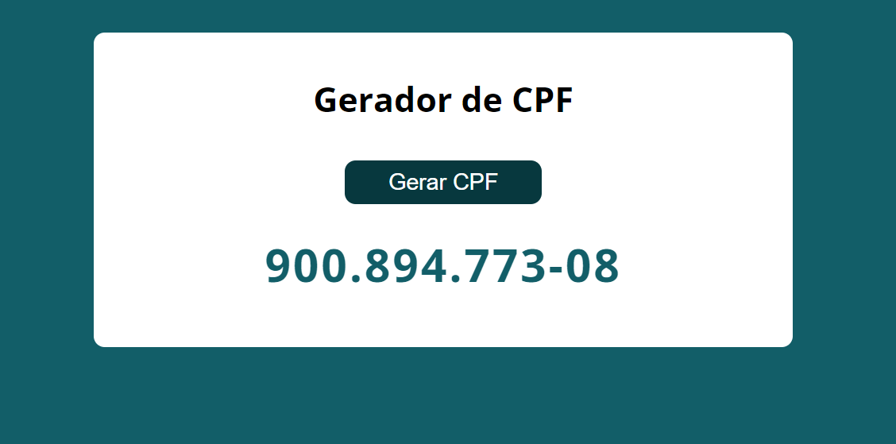

# Gerador de CPF 
---
### :bulb: Funcionalidades

* Gera um CPF aleatório valido

> Com este gerador de cpf você poderá gerar um cpf aleatório valido quantas vezes quiser

:link: - Live Site URL: [https://thiago87dev.github.io/geradorCPF/](https://thiago87dev.github.io/geradorCPF/)

---

### 🛠️ Construído com

* HTML5
* CSS3
* JavaScript ES6
* Webpack
---

### :camera: Screenshot 

## ✒️ Autor
# :raising_hand: Thiago Alves

- Linkedin - [Thiago Alves](https://www.linkedin.com/in/thiago-alves-010915274/)
- GitHub - [Thiago87dev](https://github.com/Thiago87dev)
- Frontend Mentor - [@MrThiago87](https://www.frontendmentor.io/profile/MrThiago87)
- Instagram - [@thiagopaulista87](https://www.instagram.com/thiagopaulista87/)
